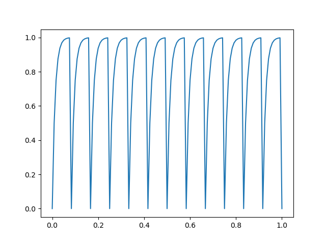
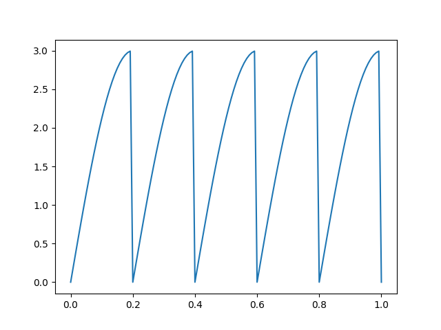
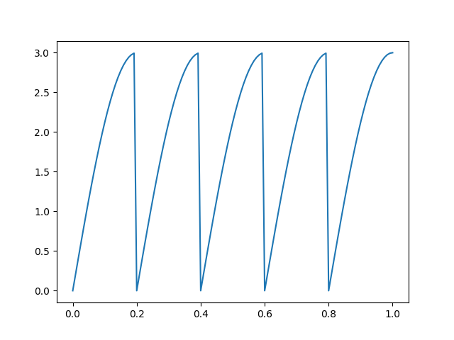
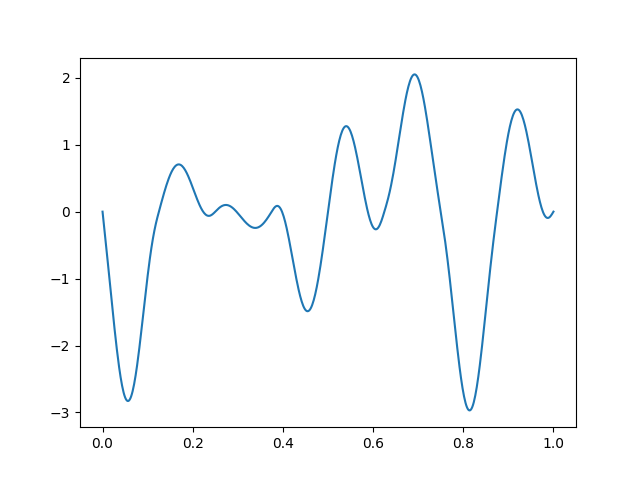
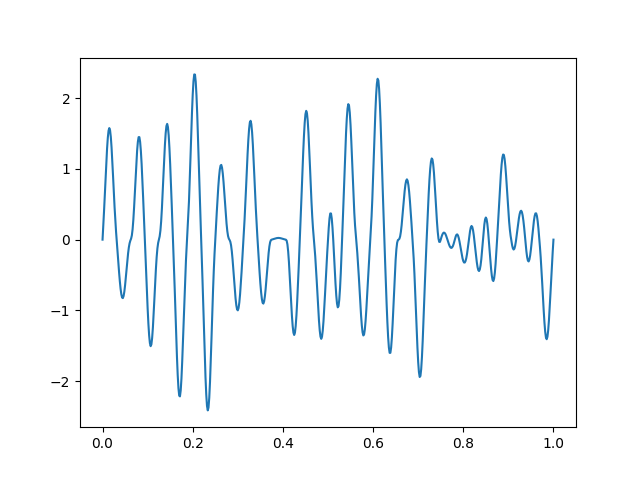

# About

This project generates KeyFrame using Easing Functions.
You can use KeyFrame generated for deforum stable diffusion and etc.

# How to use

`sudo ./examples/run.sh`

# Example





## Easing/easeOutCubic
```_.py
python ./main.py --out_path ./out/out.txt --formulra_type easing --ease_loop --amp 3.0 --freq 5 --offset 0.0 --easing easeOutCubic --preview
```


```_.py
python ./main.py --out_path ./out/out.txt --formulra_type easing --amp 3.0 --freq 5 --offset 0.0 --easing easeOutCubic --preview
```



```_.py
python ./main.py --out_path ./out/out.txt --max_frames 600 --formulra_type noise --amp 3.0 --noise_loop 3 --preview
```


```_.py
python ./main.py --out_path ./out/out.txt --max_frames 600 --formulra_type noise --amp 3.0 --noise_loop 5 --preview
```


## Easing/noise

# Reference

- [easing function](https://easings.net/#easeOutExpo "easing function")
